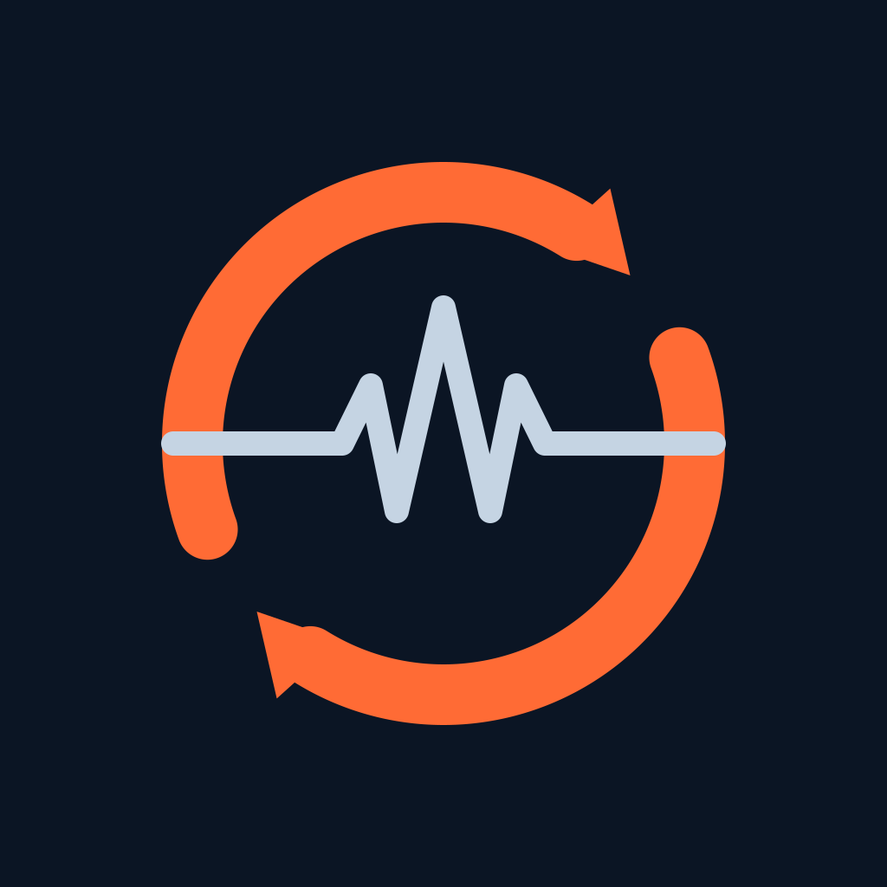

#  Better Mi Fitness Sync

The official Mi Fitness app often does not sync all of your health data to Health Connect or Apple Health. **Better Mi Fitness Sync** is built to fix that. It pulls steps, heart rate, SpO₂, sleep, weight, workouts, and more from your Mi account so everything shows up where you already track health.

## Download latest

These buttons always point at the **newest published release**.

[](https://github.com/ilyasaftr/better-mi-fitness-sync/releases/latest/download/BetterMiFitnessSync.apk)
[](https://github.com/ilyasaftr/better-mi-fitness-sync/releases/latest/download/BetterMiFitnessSync.ipa)
[](https://github.com/ilyasaftr/better-mi-fitness-sync/releases/latest)

| Platform | Direct download (latest) |
|----------|--------------------------|
| **Android** | [BetterMiFitnessSync.apk](https://github.com/ilyasaftr/better-mi-fitness-sync/releases/latest/download/BetterMiFitnessSync.apk) |
| **iOS** | [BetterMiFitnessSync.ipa](https://github.com/ilyasaftr/better-mi-fitness-sync/releases/latest/download/BetterMiFitnessSync.ipa) |

## Install on Android

1. Download **[BetterMiFitnessSync.apk](https://github.com/ilyasaftr/better-mi-fitness-sync/releases/latest/download/BetterMiFitnessSync.apk)** from the latest release.
2. Open the file on your phone.
3. If Android blocks it, allow **Install unknown apps** for your browser or Files app, then try again.
4. Open **Health Connect** and grant the permissions the app requests (or approve them when the app asks).
5. Sign in with your **Mi Account**, pick what to sync, then run a sync.

Optional (computer):

```bash
adb install -r BetterMiFitnessSync.apk
```

**Requirements:** Android with [Health Connect](https://play.google.com/store/apps/details?id=com.google.android.apps.healthdata) available (or preinstalled on newer devices).

## Install on iOS

CI builds an **unsigned** device IPA (no App Store or TestFlight signing). You re-sign and install with your own Apple ID tooling.

1. Download **[BetterMiFitnessSync.ipa](https://github.com/ilyasaftr/better-mi-fitness-sync/releases/latest/download/BetterMiFitnessSync.ipa)** from the latest release.
2. Install with a sideload tool of your choice, for example:
   - [Sideloadly](https://sideloadly.io/)
   - AltStore / SideStore
   - TrollStore (if your device supports it)
   - Xcode (build and run from source with your team signing)
3. On first launch, allow **Health** (HealthKit) access when prompted.
4. Sign in with your **Mi Account**, pick what to sync, then run a sync.

**Requirements:** Physical iPhone (HealthKit is not available on Simulator for real use). Free Apple ID sideloading typically lasts about 7 days. Paid Developer accounts last longer.

## What it does

- Sign in to Mi Fitness (email, password, or browser verification)
- Pull steps, heart rate, SpO₂, sleep, weight, workouts, and related metrics
- Write them into Health Connect (Android) or HealthKit (iOS)
- Optional auto-sync on a schedule
- Credentials and tokens stay **on your device**. This app is a sync bridge, not a cloud health store.

## Privacy

- Login credentials and session tokens are stored locally on the device.
- Health samples go from **Mi Fitness** to **your phone’s health store**.
- There is no Better Mi Fitness Sync backend that keeps a copy of your health history.
